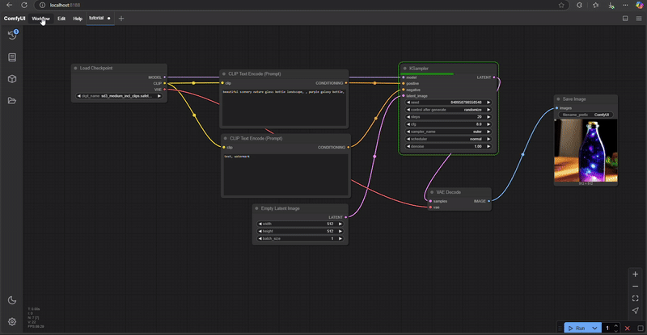
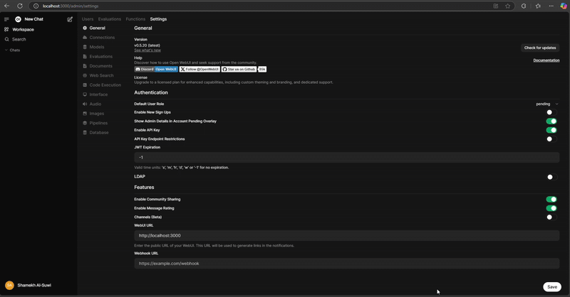
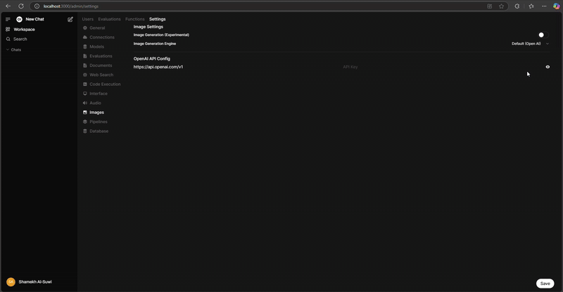
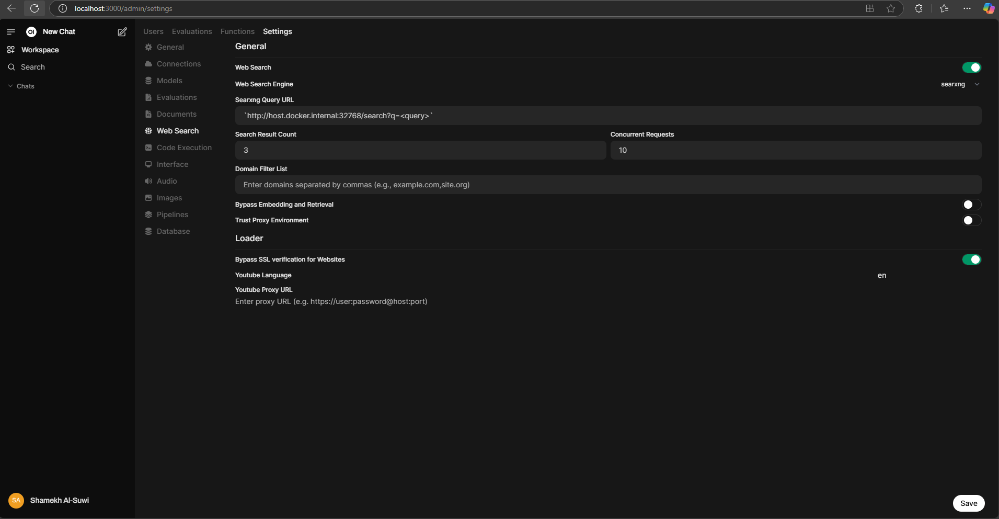
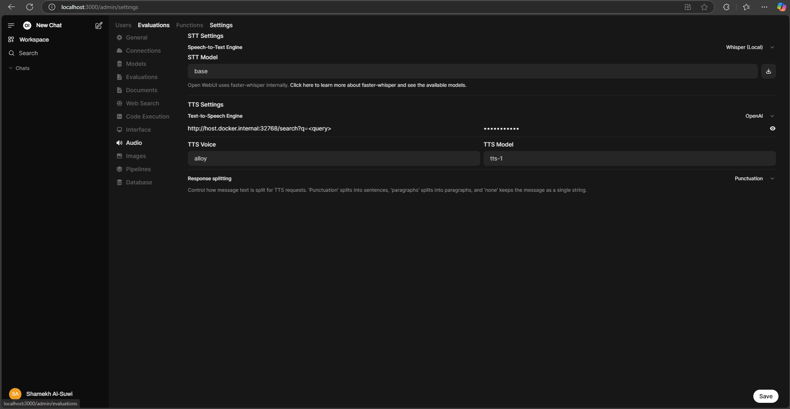
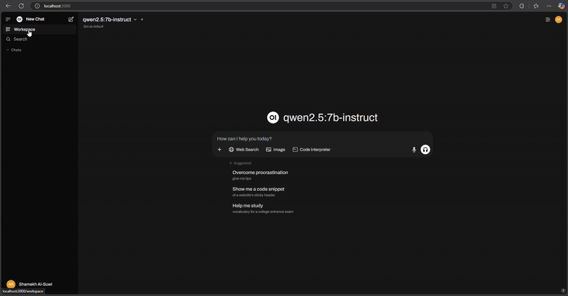
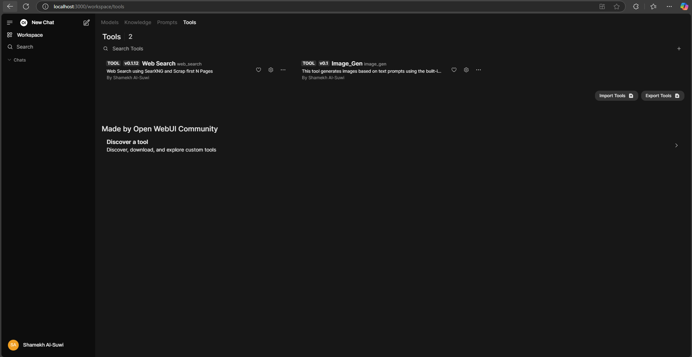

# ComicAI
Shamekh Al Suwi - AI M.Sc - Practical Work - JKU Linz

## Overview
ComicAI is a project focused on visualizing tabletop role-playing game narratives, particularly Dungeons & Dragons (DnD). The goal is to bridge the gap between oral storytelling and digital visualization by summarizing and structuring game dialogue into compelling visual stories.

### Objectives
- Summarize game dialogue data
- Organize it into storytelling structures (e.g., Hero’s Journey)
- Create a visualization to enhance narrative immersion

## Prerequisites    
- Python 3.12.9  
- Docker  


# Setup Environment 

## Docker Containers Setup

```bash
# Install the venv requirements
python -m venv comicai 
comicai\Scripts\activate 
# deactivate if needed
pip install -r requirements.txt

# Install Open WebUI
docker run -d `
    -p 3000:8080  `
    --add-host=host.docker.internal:host-gateway  `
    -v open-webui:/app/backend/data  `
    --name openwebui  `
    --restart always  `
    -e ENABLE_ADMIN_CHAT_ACCESS=false  `
    -e ENABLE_ADMIN_EXPORT=false  `
    -e ENV="dev"  `
    -e ENABLE_IMAGE_GENERATION=true `
    -e COMFYUI_BASE_URL=http://host.docker.internal:8188 `
    -e WEBUI_NAME="Comic AI" ghcr.io/open-webui/open-webui:main

# Stop and remove the existing container
docker stop openwebui
docker rm openwebui

# Remove the Docker volume containing the settings/passwords
docker volume rm open-webui

# Install Ollama to handle Huggingface models 
docker run -d  `
    --gpus=all  `
    --name ollama `
    --restart always  `
    -v ollama:/root/.ollama  `
    -p 11434:11434  `
    --name ollama ollama/ollama

# Searxng
mkdir searxng
cd searxng
docker pull searxng/searxng
docker run --rm `
    -d -p 32768:8080 `
    -v "${PWD}/searxng:/etc/searxng" `
    -e "BASE_URL=http://localhost:32768/" `
    -e "INSTANCE_NAME=searxng" `
    --name searxng searxng/searxng
cd ..

# Text-To-Speech service by Edge Browser
docker run -d -p 5050:5050  -e API_KEY=usability10  travisvn/openai-edge-tts:latest
```

The previous commands are the foundation of our UI. From her we need to set ComfyUI and OpenwebUI from their own UIs

## ComfyUI Setup

```bash
# ComfyUI for NVIDIA users (run in a separate terminal run)
git clone https://github.com/comfyanonymous/ComfyUI
cd comfyui
pip install -r requirements.txt
python main.py --listen
cd .. 
```
Read more about the models used [here](https://stability.ai/learning-hub/setting-up-and-using-sd3-medium-locally) and download them from [here](https://huggingface.co/ckpt/stable-diffusion-3-medium/tree/main)

1. Go to **ComicAI\ComfyUI\models**. 
2. Place the model [sd3_medium_incl_clips](https://huggingface.co/ckpt/stable-diffusion-3-medium/resolve/main/sd3_medium_incl_clips.safetensors?download=true) in the **checkpoints** and **unet** directories.
3. Place the [ae.safetensors](https://huggingface.co/black-forest-labs/FLUX.1-schnell/resolve/main/ae.safetensors?download=true) in the **vae** directory.
4. Place the [clip_l.safetensors](https://huggingface.co/comfyanonymous/flux_text_encoders/resolve/main/clip_l.safetensors?download=true) and either [t5xxl_fp16.safetensors](https://huggingface.co/comfyanonymous/flux_text_encoders/resolve/main/t5xxl_fp16.safetensors?download=true) or [t5xxl_fp8_e4m3fn.safetensors](https://huggingface.co/comfyanonymous/flux_text_encoders/resolve/main/t5xxl_fp8_e4m3fn.safetensors?download=true) in the **clip** directory.
5. Go to http://localhost:8188/ in your browser 
6. Load your model in the checkpoints widget 
7. (Optional) Run the workflow 
8. Generate export a workflow API to import in **OpenwebUI** 


## Connecting the Components in OpenwebUI 
After setting up the necessary services, follow these steps to connect them via OpenWebUI:

DO NOT FORGET TO SAVE YOUR CHOICES BEFORE MOVING TO OTHER TABS

1. Open OpenWebUI in a browser http://localhost:3000 and navigate to **Admin Panel → Settings**. 

2. Under Enable image workflow generation under the **Image** tab by importing your **ComfyUI** API file. 

3. Disable OpenAI API and Connect **Ollama** in the **Connections** tab (`http://host.docker.internal:11434`). 

4. Under the **Web Search** tab, configure Searxng (`http://host.docker.internal:32768/search?q=<query>`). 

5. Under the **Audio** tab, set up text-to-speech (`http://host.docker.internal:5050/v1`) with API key (`usability10`). 

What is left now is enabling users to use these integrations

## Import Models and Tools

1. In your browser navigate to **Workplace → Models** and import the provided model file. 

2. In the Tools tab also import the provided tool files **tool-image_gen-export** and **tool-web_search-export** 

## Features
- **Narrative Summarization**: Extracts key dialogue and structures them using storytelling techniques.
- **Real-time Visualizations**: Generates images for DnD narratives.
- **Speech-to-Text & Text-to-Speech**: Converts spoken dialogue into text and vice versa.
- **Search Aggregation**: Uses a metasearch engine for enhanced narrative research.

## Image Generation 
Refer to https://docs.openwebui.com/tutorials/images documentation on the matter.


## Challenges & Future Work
### Current Limitations
- The Hero’s Journey framework is difficult to implement at scale.
- Improvements needed in **data segmentation** and **prompt generation**.

### Future Enhancements
- Real-time DnD session generation
- Improved narrative analysis
- Monetization opportunities

## Conclusion
Inspired by Carl Sagan’s philosophy: *"To create an apple pie from scratch, you must first create the universe."* Similarly, ComicAI aimed for a mini GPT to transform raw gameplay data into immersive visual narratives.
 